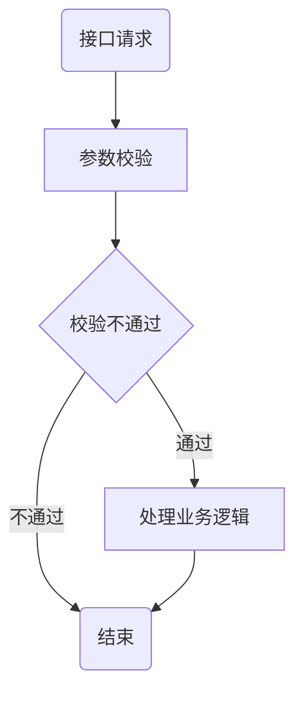

# useful links

> this file notes all the useful website , once browser bookmarks dispatch, I can find back all the sites those I need.

## links

[CircleCI 自动化部署](https://zhuanlan.zhihu.com/p/370550987)

[阿里云Docker快速安装](https://www.cnblogs.com/hongmaju/p/15598990.html)

[Docker Compose安装](https://www.cnblogs.com/lihw-study/p/16022277.html)

[ssh: connect to host github.com port 22: Connection timed out](https://blog.csdn.net/hdm314/article/details/119947761)

[clion mingw环境配置](https://zhuanlan.zhihu.com/p/43680621)

[Java中18种锁](https://mp.weixin.qq.com/s/QYJLQN2XsI88Gh0xOxS4MA)

[Nacos原理](https://mp.weixin.qq.com/s/4QgQ1h9VSJZ4c2tFDm6log)

[加速Spring启动速度](https://mp.weixin.qq.com/s/ZMIUXDc7yY64GDE70g3-kA)

[Overall Technical Architecture of Dubbo Mesh](https://www.alibabacloud.com/blog/overall-technical-architecture-of-dubbo-mesh_600029)

multiple deployment modes (SDK, Sidecar, and Agent)

[seata分布式事务](https://mp.weixin.qq.com/s/cM8XUouYGnUVYwm1qgUqVQ)

> `Java`中如果一个没有被容器管理的抽象类、实体类被一个容器管理的实体类继承，那么抽象类也会自动交给容器管理。

[Docusaurus建站（2）- 部署到GitHub Pages](https://juejin.cn/post/7115631818736402440)

## 深入理解Apache Dubbo与实战

- 第三章
FailbackRegistry又继承了 AbstractRegistry,重写了父类的注册、订阅、查询和通知等 方法，并且添加了重试机制。此外，还添加了四个未实现的抽象模板方法。

虽然每种注册中心都有自己具体的工厂类，但是在什么地方判断，应该调用哪个工厂类实 现呢?代码中并没有看到显式的判断。答案就在RegistryFactory接口中，该接口里有一个 Registry getRegistry(URL url)方法，该方法上有@Adaptive({"protocol"))注解。

Dubbo良好的扩展性与两个方面是密不可分的，一是整个框架中针对不同的场景，恰到好 处地使用了各种设计模式，二就是本章要介绍的加载机制。

## mermaid示例

> [this code from](https://juejin.cn/post/7038144693867118629)

