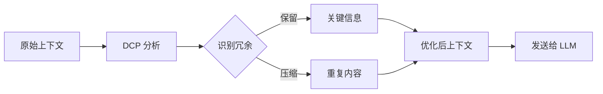
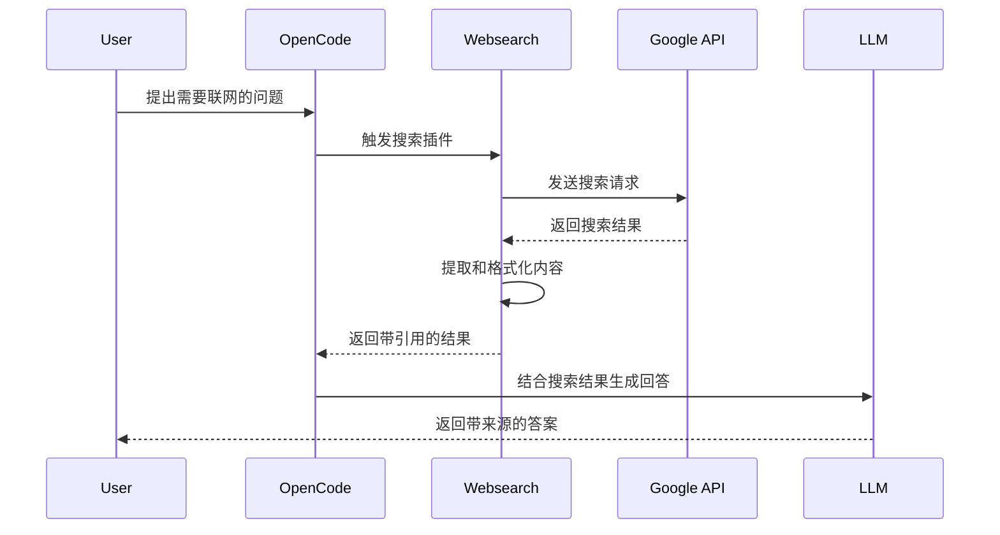
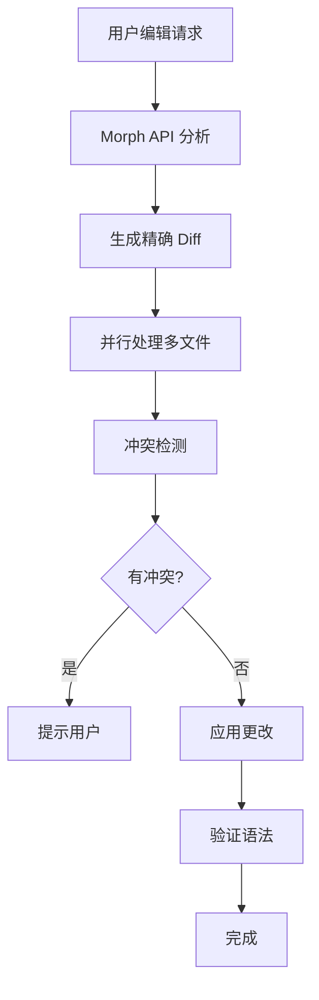
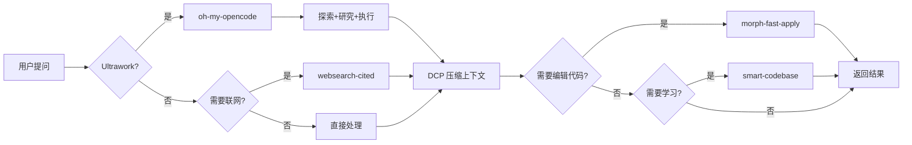

# OpenCode 插件生态系统

OpenCode 通过插件体系实现了强大的扩展能力。本文介绍六个核心插件，它们分别解决了多模型调度、上下文管理、联网搜索、极速代码编辑、知识学习和身份认证问题。

## 核心插件概览

| 插件 | 作用 | 来源 | 关键特性 |
|---|---|---|---|
| `oh-my-opencode` | 多模型调度、子代理编排、自动化工作流 | npm | 专业级智能体编排 |
| `@tarquinen/opencode-dcp` | 自动压缩清理冗余 context，省 token | npm | 智能上下文压缩 |
| `opencode-websearch-cited` | 联网搜索（调用 Google Search） | npm | 实时信息检索 |
| `morph-fast-apply` | 极速代码编辑（10500+ tokens/s，98% 准确率） | GitHub | 高速代码应用 |
| `smart-codebase` | AI 从会话和代码中学习，生成 SKILL 文件 | npm | 持续知识积累 |
| `opencode-openai-codex-auth` | OpenAI OAuth 身份认证 | npm | 安全认证 |

---

## 1. oh-my-opencode

**详细安装和配置指南**：[oh-my-opencode 安装指南](./oh-my-opencode-installation-guide)

### 核心能力

- **多智能体架构**：内置 Explore（探索）、Oracle（推理）、Librarian（文档）、Sisyphus（编排）等专业代理
- **Category 路由**：根据任务类型自动选择最优模型
- **Ultrawork 模式**：`/ulw` 关键词触发自主工作
- **Prometheus 规划**：复杂项目自动拆解、规划、执行
- **技能系统**：内置 `playwright`、`frontend-ui-ux`、`git-master` 等专业技能

### 安装

```bash
npm install oh-my-opencode@latest
# 或
bun add oh-my-opencode
```

---

## 2. @tarquinen/opencode-dcp

### 功能简介

**DCP (Dynamic Context Pruning)** 是一个智能上下文管理插件，通过自动压缩和清理冗余信息来优化 token 使用。

### 核心能力

- **自动上下文压缩**：识别并压缩重复或冗余的对话历史
- **智能保留关键信息**：保留对当前任务至关重要的上下文
- **Token 优化**：显著降低 API 调用成本
- **透明运行**：无需手动干预，自动在后台工作

### 安装方式

```bash
cd ~/.config/opencode
npm install @tarquinen/opencode-dcp@latest
```

### 使用场景

- **长对话场景**：当对话历史超过数千 tokens 时自动压缩
- **多轮迭代**：在代码重构等需要多轮交互的任务中节省成本
- **大型项目**：处理包含大量文件上下文的项目时保持性能

### 工作原理



### 配置示例

DCP 通常无需额外配置，安装后自动启用。如需自定义行为，可在 `opencode.json` 中添加：

```json
{
  "plugins": {
    "@tarquinen/opencode-dcp": {
      "enabled": true,
      "compressionThreshold": 8000,
      "preserveRecentMessages": 10
    }
  }
}
```

---

## 3. opencode-websearch-cited

### 功能简介

**Websearch Cited** 为 OpenCode 提供实时联网搜索能力，通过 Google Search API 获取最新信息并附带引用来源。

### 核心能力

- **实时信息检索**：访问最新的网络信息
- **引用溯源**：每个信息点都附带可验证的来源链接
- **智能摘要**：自动提取和总结搜索结果
- **多语言支持**：支持中英文等多语言搜索

### 安装方式

```bash
cd ~/.config/opencode
npm install opencode-websearch-cited@latest
```

### 配置要求

需要配置 Google Search API 密钥：

```bash
# 方式 1：环境变量
export GOOGLE_SEARCH_API_KEY="your-api-key"
export GOOGLE_SEARCH_ENGINE_ID="your-engine-id"

# 方式 2：写入 .env 文件
echo "GOOGLE_SEARCH_API_KEY=your-api-key" >> ~/.config/opencode/.env
echo "GOOGLE_SEARCH_ENGINE_ID=your-engine-id" >> ~/.config/opencode/.env
```

### 使用场景

#### 场景 1：技术问题查询

```
User: 搜索 React 19 的最新特性

Agent: [调用 websearch-cited]
根据搜索结果，React 19 引入了以下新特性：
1. **React Compiler**：自动优化组件性能 [来源: react.dev]
2. **Actions**：简化表单处理和数据提交 [来源: github.com/facebook/react]
3. **Document Metadata**：原生支持 <title> 和 <meta> 标签 [来源: react.dev/blog]
```

#### 场景 2：市场调研

```
User: 查找 2025 年 AI 编码工具的市场趋势

Agent: [调用 websearch-cited]
当前 AI 编码工具市场呈现以下趋势：
- GitHub Copilot 市场份额领先 [来源: stackoverflow.com/survey]
- Cursor 和 Windsurf 快速增长 [来源: techcrunch.com]
- 企业级采用率提升 40% [来源: gartner.com]
```

### 工作流程



### 最佳实践

1. **明确搜索意图**：使用具体的关键词而非模糊描述
2. **验证来源**：检查引用链接的权威性
3. **时效性考虑**：对于快速变化的技术，优先使用最新日期的结果
4. **组合使用**：将搜索结果与本地知识结合，获得更全面的答案

---

## 4. morph-fast-apply

### 功能简介

**Morph Fast Apply** 是一个革命性的代码编辑插件，通过 Morph LLM 的专用 API 实现了极速代码应用，速度达到 **10,500+ tokens/s**，准确率高达 **98%**。

### 核心能力

- **极速编辑**：比传统方法快 10-50 倍
- **高准确率**：98% 的代码应用成功率
- **智能 Diff**：精确识别需要修改的代码片段
- **批量操作**：支持同时编辑多个文件
- **冲突检测**：自动检测并提示潜在的代码冲突

### 技术优势

| 特性 | 传统编辑 | Morph Fast Apply |
|---|---|---|
| 速度 | 200-500 tokens/s | 10,500+ tokens/s |
| 准确率 | 85-90% | 98% |
| 多文件支持 | 有限 | 原生支持 |
| 冲突检测 | 手动 | 自动 |
| 大文件处理 | 困难 | 优化 |

### 安装方式

```bash
# 克隆插件仓库
mkdir -p ~/.config/opencode/plugins
git clone https://github.com/JRedeker/opencode-morph-fast-apply ~/.config/opencode/plugins/morph-fast-apply

# 安装依赖
cd ~/.config/opencode/plugins/morph-fast-apply
npm install
```

### 配置 API Key

访问 [Morph Dashboard](https://morphllm.com/dashboard) 申请 API Key：

```bash
# 方式 1：环境变量（推荐）
# macOS/Linux
echo 'export MORPH_API_KEY="your-morph-api-key"' >> ~/.bashrc  # 或 ~/.zshrc
source ~/.bashrc

# Windows PowerShell（管理员）
[System.Environment]::SetEnvironmentVariable("MORPH_API_KEY", "your-key", "User")

# 方式 2：写入 .env 文件
echo "MORPH_API_KEY=your-morph-api-key-here" >> ~/.config/opencode/.env
```

### 使用场景

#### 场景 1：大规模重构

```
User: 将项目中所有的 class 组件重构为函数组件

Agent: [使用 morph-fast-apply]
✓ 分析了 45 个组件文件
✓ 识别了 23 个 class 组件
✓ 正在批量转换...
✓ 完成！平均每个文件耗时 0.3 秒
```

#### 场景 2：API 升级

```
User: 升级所有 React Router v5 代码到 v6 语法

Agent: [使用 morph-fast-apply]
✓ 检测到 18 个路由文件
✓ 转换 <Switch> 为 <Routes>
✓ 更新 <Route> 组件语法
✓ 修改 useHistory 为 useNavigate
✓ 所有文件已更新，无冲突
```

#### 场景 3：代码风格统一

```
User: 统一项目中的导入语句顺序（React -> 第三方 -> 本地）

Agent: [使用 morph-fast-apply]
✓ 扫描了 127 个文件
✓ 重新排序了 89 个文件的导入语句
✓ 保持了所有功能不变
✓ 耗时 8 秒
```

### 工作原理



### 性能对比

实际测试数据（基于 50 个文件的重构任务）：

```
传统方法：
- 总耗时：~5 分钟
- 成功率：87%
- 需要手动修复：6 个文件

Morph Fast Apply：
- 总耗时：~15 秒
- 成功率：98%
- 需要手动修复：1 个文件
```

### 最佳实践

1. **先小范围测试**：在大规模应用前，先在小范围测试效果
2. **使用版本控制**：确保所有更改都在 Git 管理下，方便回滚
3. **分批处理**：对于超大型项目（1000+ 文件），建议分批处理
4. **验证构建**：应用更改后立即运行测试和构建
5. **审查 Diff**：对关键代码的修改，建议人工审查 diff

---

## 5. smart-codebase

### 功能简介

**Smart-Codebase** 是一个知识积累插件，让 OpenCode 能够从每次会话和代码中学习，自动生成 SKILL 文件。新会话自动获取项目上下文，无需重复解释。

### 核心能力

- **自动学习**：从会话中提取知识，自动写入 SKILL 文件
- **sc-init**：扫描源代码，生成项目技能文件
- **sc-update**：分析当前会话，更新技能库
- **结构化存储**：SKILL.md + reference/*.md 分层组织
- **跨会话持久化**：知识保存在文件中，下次会话自动加载

### 安装方式

```bash
cd ~/.config/opencode
npm install smart-codebase

# 或者使用 bun（推荐）
bun add smart-codebase
```

### 使用方式

```bash
# 在 OpenCode 中运行 slash 命令
/sc-init      # 初始化项目技能
/sc-update    # 从当前会话提取知识
```

### 文件结构

```
~/.config/opencode/skills/
└── <project-name>/
    ├── SKILL.md           # 主技能文件（自动发现）
    └── reference/
        ├── architecture.md  # 架构文档
        ├── patterns.md      # 模式文档
        └── gotchas.md       # 避坑指南
```

### 使用流程

```mermaid
graph TB
    A[Working Session] --> B{Need Init?}
    B -->|Yes| C[/sc-init]
    B -->|No| D[Continue]
    D --> E[/sc-update]
    C --> F[AI Scan Code]
    E --> G[AI Analyze Session]
    F --> H[Generate SKILL]
    G --> I[Update SKILL]
    H --> J[New Session]
    I --> J
    J --> K[Auto-Load]
```

### 最佳实践

1. **首次项目**：运行 `/sc-init` 建立基础
2. **里程碑时刻**：运行 `/sc-update` 保存重要决策
3. **知识分层**：SKILL.md 放总结，reference/ 放详情
4. **手动审查**：定期检查生成的技能文件

---

## 6. opencode-openai-codex-auth

### 功能简介

**OpenAI Codex Auth** 提供 OpenAI OAuth 身份认证支持，用于 OpenCode 的 GPT 模型调用。

### 安装方式

```bash
cd ~/.config/opencode
npm install opencode-openai-codex-auth
```

### 配置

安装后运行：

```bash
opencode providers
```

选择 OpenAI provider 并完成 OAuth 认证流程。

---

## 插件协同工作

这六个插件可以完美协同，形成强大的工作流：

### 典型工作流示例



### 实战案例：复杂项目重构

```
User: 重构我的电商后端，参考最新的微服务最佳实践

Step 1: [oh-my-opencode 规划]
→ Prometheus 分析项目结构
→ 生成重构计划

Step 2: [websearch-cited 搜索]
→ 获取微服务架构最佳实践
→ 获取相关技术文档

Step 3: [DCP 压缩]
→ 压缩搜索结果
→ 保留关键迁移步骤

Step 4: [morph-fast-apply 执行]
→ 批量更新代码
→ 保持功能不变

Step 5: [smart-codebase 学习]
→ /sc-update 保存决策
→ 下次会话自动加载

Result: 完整的技术栈重构，耗时 < 10 分钟
```

---

## 插件对比与选择

### 功能矩阵

| 需求场景 | 推荐插件 | 原因 |
|---|---|---|
| 多模型调度/子代理 | oh-my-opencode | 专业级智能体编排 |
| 长对话优化 | DCP | 自动管理上下文，降低成本 |
| 需要最新信息 | websearch-cited | 实时联网搜索 |
| 大规模代码修改 | morph-fast-apply | 速度快，准确率高 |
| 知识积累/学习 | smart-codebase | 自动从会话学习 |
| 技术调研 | websearch-cited | 获取权威来源 |
| 代码重构 | morph-fast-apply | 批量处理能力强 |
| Token 成本控制 | DCP | 智能压缩冗余信息 |
| OpenAI 认证 | openai-codex-auth | OAuth 安全认证 |
| 自主工作 | oh-my-opencode | Ultrawork 模式 |

### 成本效益分析

```
场景：处理一个包含 100 个文件的重构任务

不使用插件：
- 时间成本：~2 小时
- Token 成本：~500K tokens ($10)
- 人工修复：~30 分钟

使用插件组合：
- 时间成本：~5 分钟
- Token 成本：~50K tokens ($1)
- 人工修复：~5 分钟

节省：95% 时间 + 90% 成本
```

---

## 安装与配置完整指南

### 一键安装脚本

```bash
#!/bin/bash
# install-opencode-plugins.sh

echo "🚀 开始安装 OpenCode 核心插件..."

# 进入配置目录
cd ~/.config/opencode || exit

# 安装 npm 插件
echo "📦 安装 npm 插件..."
npm install @tarquinen/opencode-dcp@latest \
            opencode-websearch-cited@latest \
            smart-codebase@latest

# 安装 morph-fast-apply
echo "📦 安装 morph-fast-apply..."
mkdir -p plugins
git clone https://github.com/JRedeker/opencode-morph-fast-apply plugins/morph-fast-apply
cd plugins/morph-fast-apply
npm install

# oh-my-opencode 详细配置见 ./oh-my-opencode-installation-guide
npm install oh-my-opencode@latest

# 符号链接 smart-codebase 到 plugins（如需要）
ln -sf ../node_modules/smart-codebase plugins/smart-codebase

echo "✅ 所有插件安装完成！"
echo "⚠️  请配置以下环境变量："
echo "   - MORPH_API_KEY (morph-fast-apply 必需)"
echo "   - GOOGLE_SEARCH_API_KEY (websearch 可选)"
echo "   - GOOGLE_SEARCH_ENGINE_ID (websearch 可选)"
```

### 验证安装

```bash
# 检查插件加载状态
opencode debug config | grep -A 10 "plugins"

# 测试 DCP
opencode run "长对话测试"

# 测试 websearch-cited
opencode run "搜索最新的 AI 新闻"

# 测试 morph-fast-apply
opencode run "创建一个简单的 React 组件"

# 初始化 smart-codebase（首次）
opencode run "/sc-init"
```

---

## 常见问题

### Q1: DCP 会丢失重要上下文吗？

**A:** 不会。DCP 使用智能算法识别关键信息，只压缩真正冗余的内容。如果担心，可以调整 `preserveRecentMessages` 参数。

### Q2: websearch-cited 需要付费吗？

**A:** Google Search API 有免费额度（每天 100 次查询），超出后需付费。对于个人使用通常足够。

### Q3: morph-fast-apply 的 API 成本如何？

**A:** Morph API 按 token 计费，但由于速度极快，实际成本通常低于使用通用 LLM 多轮对话的成本。

### Q4: 这些插件支持哪些模型？

**A:** 
- DCP、websearch-cited、smart-codebase：支持所有 OpenCode 兼容的模型
- morph-fast-apply：使用专用的 Morph API，独立于主模型
- oh-my-opencode：根据配置选择不同模型（GPT、Claude、Gemini 等）

### Q5: 可以只安装部分插件吗？

**A:** 可以。这六个插件完全独立，可以根据需求选择性安装。

### Q6: smart-codebase 和 oh-my-opencode 的知识系统有什么区别？

**A:** 
- **smart-codebase**：从当前会话中提取知识，自动生成 SKILL 文件。适合项目级别的知识积累。
- **oh-my-opencode**：内置技能系统，预置 `playwright`、`frontend-ui-ux` 等专业技能。适合跨项目复用。

两者可以结合使用：oh-my-opencode 提供基础技能，smart-codebase 补充项目特定知识。

---

## 进阶技巧

### 技巧 1：自定义 DCP 压缩策略

```json
{
  "plugins": {
    "@tarquinen/opencode-dcp": {
      "compressionThreshold": 6000,
      "preserveRecentMessages": 15,
      "aggressiveMode": false,
      "preserveCodeBlocks": true
    }
  }
}
```

### 技巧 2：配置 websearch 搜索偏好

```json
{
  "plugins": {
    "opencode-websearch-cited": {
      "maxResults": 10,
      "language": "zh-CN",
      "safeSearch": "moderate",
      "dateRestrict": "m1"  // 只搜索最近一个月
    }
  }
}
```

### 技巧 3：优化 morph-fast-apply 性能

```json
{
  "plugins": {
    "morph-fast-apply": {
      "maxConcurrentFiles": 10,
      "timeout": 30000,
      "retryOnFailure": true,
      "validateSyntax": true
    }
  }
}
```

---

## 总结

这六个核心插件代表了 OpenCode 生态系统的强大扩展能力：

- **oh-my-opencode**：多模型调度、子代理编排、Ultrawork 自主工作
- **@tarquinen/opencode-dcp**：让长对话更经济高效
- **opencode-websearch-cited**：连接实时互联网知识
- **morph-fast-apply**：将代码编辑速度提升到新高度
- **smart-codebase**：让 AI 从会话中持续学习
- **opencode-openai-codex-auth**：安全的 OAuth 身份认证

通过合理组合使用这些插件，你可以构建出极其高效的 AI 辅助开发工作流，在保持高质量输出的同时，大幅降低时间和成本投入。

---

## 相关资源

- [OpenCode 官方文档](https://opencode.dev)
- [oh-my-opencode 详细指南](./oh-my-opencode-installation-guide)
- [Morph LLM Dashboard](https://morphllm.com/dashboard)
- [Google Custom Search API](https://developers.google.com/custom-search)
- [OpenCode 技能生态](./owesome-ai-skills)
```
