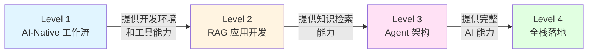

# AI Prompt 工程与全栈开发路线图

## 文档定位与使用说明

**本文档适用对象**: 具备至少一门编程语言基础 (Python/Java/JavaScript),希望系统性掌握 AI 能力的开发者

**核心目标**: 以**生成高质量 Prompt** 为核心,帮助开发者从工具使用逐步成长为能够设计企业级 AI 系统的全栈工程师

**学习路径**: Level 1 (工具驱动) → Level 2 (RAG 应用) → Level 3 (Agent 架构) → Level 4 (生产部署),每个阶段 2-3 周,总计 9-12 周

## 核心理念

### 设计原则

1. ⭐ **架构模式优先于工具学习**: 理解 Sidecar Pattern、异步解耦、结构化输出等架构模式
2. **扩展而非深读**: 将 Dify 等平台视为黑盒,专注于扩展和集成
3. ⭐ **评估左移**: 从早期就建立 Golden Dataset 和自动化评估
4. **可观测性**: 建立完整的 Agent 行为追踪和质量监控体系
5. ⭐ **双轨并进**: 既掌握快速交付工具 (Dify),又具备深度定制能力 (LangGraph)

### 技术路线双轨制

- ⭐ **生产力轨道 (80% 场景)**: Dify, Ollama, MCP —— 快速解决通用需求
- **硬实力轨道 (20% 核心难题)**: PyTorch, LangGraph, VectorDB —— 攻克复杂问题

## 能力演进路径

## 快速导航

| 阶段 | 周期 | 核心目标 | 优先级 |
|------|------|----------|--------|
| ⭐ [Level 1: AI-Native 工作流](./level-1-ai-native) | 第 1-2 周 | 建立 AI 优先的开发习惯,搭建本地 AI 基础设施 | 必须先学 |
| ⭐ [Level 2: RAG 应用开发](./level-2-rag) | 第 3-5 周 | 掌握检索增强生成 (RAG),理解异构系统架构 | 核心能力 |
| [Level 3: Agent 架构](./level-3-agent) | 第 6-8 周 | 掌握智能决策与路由,建立可观测性和审计能力 | 进阶 |
| [Level 4: 全栈落地](./level-4-production) | 第 9-12 周 | 完成前后端全栈交付,掌握模型微调和生产部署 | 高级 |
| [Prompt 质量评估与总结](./summary) | - | Prompt 质量标准、技能组合、面试突击清单 | 参考 |

## 关键成功因素

1. ⭐ **架构模式优先于工具学习**: 理解 Sidecar Pattern、异步解耦、结构化输出等架构模式
2. **扩展而非深读**: 将 Dify 等平台视为黑盒,专注于扩展和集成
3. ⭐ **评估左移**: 从 Level 2 开始就建立 Golden Dataset 和自动化评估
4. **可观测性**: 建立完整的 Agent 行为追踪和质量监控体系
5. ⭐ **双轨并进**: 既掌握快速交付工具 (Dify),又具备深度定制能力 (LangGraph)

> 你的 **Java/React 经验** 决定了你能把系统搭建得多**稳** (复杂架构能力),而你对 **AI 工具的驱动能力** 决定了你能跑得多**快** (开发效率)。
>
> **这两个加上去,才是真正的 Full Stack AI Engineer。**
