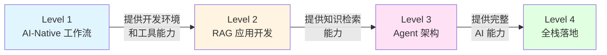

# AI 应用开发路线图

## 文档定位与使用说明

**适用对象**: 有编程基础 (Python/Java/JavaScript)，希望系统性掌握 AI 应用开发能力的开发者

**核心目标**: 从工具使用到架构设计，逐步成长为能够交付企业级 AI 系统的工程师

**学习路径**: Level 1 (工具与基础设施) → Level 2 (RAG) → Level 3 (Agent) → Level 4 (生产部署)，每阶段 2-3 周，总计 9-12 周

:::tip Java 开发者说明
如果你的主技术栈是 Java / Spring Boot，可以优先关注 **Spring AI** 和 **LangChain4j** 生态。本文档示例以 Python 为主，但核心概念（RAG、Tool Calling、结构化输出、Agent 编排）是语言无关的，Java 侧均有对应方案。
:::

## 核心理念

### 设计原则

1. ⭐ **架构模式优先于工具学习**: 理解异步解耦、结构化输出等架构模式，而非只学 API 调用
2. **扩展而非深读**: 将 Dify 等平台视为黑盒，专注于扩展和集成
3. ⭐ **评估左移**: 从早期就建立 Golden Dataset 和自动化评估
4. **可观测性**: 建立 Agent 行为追踪和质量监控体系
5. ⭐ **双轨并进**: 既掌握快速交付工具 (Dify)，又具备深度定制能力 (LangGraph / Spring AI)

### 技术路线双轨制

- **生产力轨道 (80% 场景)**: Dify, Ollama, MCP —— 快速交付通用需求
- **硬实力轨道 (20% 核心难题)**: LangGraph / LangChain4j, VectorDB —— 攻克复杂问题

## 能力演进路径

```mermaid
graph LR
    A[Level 1<br/>AI-Native 工作流] -->|提供开发环境<br/>和工具能力| B[Level 2<br/>RAG 应用开发]
    B -->|提供知识检索<br/>能力| C[Level 3<br/>Agent 架构]
    C -->|提供完整<br/>AI 能力| D[Level 4<br/>全栈落地]
    
    style A fill:#e1f5ff
    style B fill:#fff4e1
    style C fill:#ffe1f5
    style D fill:#e1ffe1
```

## 快速导航

| 阶段 | 周期 | 核心目标 | 优先级 |
|------|------|----------|--------|
| ⭐ [Level 1: AI-Native 工作流](./level-1-ai-native) | 第 1-2 周 | 建立 AI 优先的开发习惯,搭建本地 AI 基础设施 | 必须先学 |
| ⭐ [Level 2: RAG 应用开发](./level-2-rag) | 第 3-5 周 | 掌握检索增强生成 (RAG),理解异构系统架构 | 核心能力 |
| [Level 3: Agent 架构](./level-3-agent) | 第 6-8 周 | 掌握智能决策与路由,建立可观测性和审计能力 | 进阶 |
| [Level 4: 全栈落地](./level-4-production) | 第 9-12 周 | 完成前后端全栈交付,掌握模型微调和生产部署 | 高级 |
| [Prompt 质量评估与总结](./summary) | - | Prompt 质量标准、技能组合、面试突击清单 | 参考 |

> 工程能力决定系统搭得多稳，AI 驱动能力决定迭代跑得多快。两者结合才是完整的 AI 工程能力。
