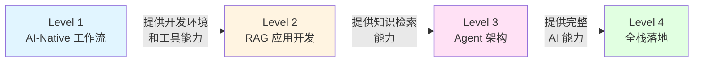

# Prompt 质量评估与总结

## Prompt 质量评估标准

一个高质量的 Prompt 应该满足:

### 1. 明确性 (Clarity)

- 清晰定义角色 (你是一位...)
- 明确任务 (需求:...)
- 指定输出格式 (请生成...)

### 2. 上下文完整性 (Context Completeness)

- 提供足够的背景信息
- 包含相关的代码片段、错误日志、业务规则
- 说明技术栈和环境

### 3. 可验证性 (Verifiability)

- 输出结果可以通过明确的标准验证
- 包含质量判断标准 (如"代码必须符合 DDD 原则")

### 4. 可复用性 (Reusability)

- 可以作为模板应用于类似场景
- 参数化设计 (用 [占位符] 标记可替换部分)

### 5. 约束清晰 (Clear Constraints)

- 明确说明技术栈、规范、限制条件
- 说明不应该做什么 (反面案例)

### 评分方法 (5 分制)

- **5 分**: 满足所有 5 条标准,可直接用于生产
- **4 分**: 满足 4 条标准,稍作调整即可使用
- **3 分**: 满足 3 条标准,需要补充上下文或约束
- **2 分及以下**: 需要重写

---

## 技能组合拳总结

### 左手 Python (AI 逻辑)

- 写 LangGraph 状态图
- 高级 RAG 策略 (Parent-Child, HyDE)
- FastAPI 接口封装
- 微调脚本 (LoRA/QLoRA)

### 右手 Java (工程底座)

- 高性能网关 (Spring Cloud Gateway)
- 业务系统集成 (Feign Client)
- 企业级鉴权 (Spring Security)
- 消费 Python 生产的 JSON 数据 (OpenAPI 生成 DTO)

### 大脑 (架构思维)

- 设计 Dify 工作流
- Router 分发策略
- 系统容错与评估体系
- 异构系统解耦 (Sidecar Pattern, MQ)

---

## 2026 面试突击清单

### 必问技术点

1. **Dify vs LangChain vs 手写代码**: 
   - Dify: 80% 通用场景,快速交付,但定制能力弱
   - LangChain: 代码级控制,但过于复杂
   - LangGraph: 复杂决策逻辑,状态图编程
   - 手写代码: 完全定制,但开发成本高

2. **RAG 进阶**: 
   - 问题: 如何解决"检索不到"?
   - 答案: Parent-Child Indexing (精准检索 + 上下文保留) 或 HyDE (假设性文档嵌入)

3. **结构化输出**: 
   - 问题: Java 业务系统如何稳定解析 AI 的回复?
   - 答案: Python 端使用 Instructor + Pydantic 强制约束,Java 端使用 OpenAPI 生成 DTO

4. **Agent 原理**: 
   - ReAct 模式: Reasoning (推理) + Acting (行动) 循环
   - LangGraph 如何解决死循环: 设置 `max_iterations` 和 `recursion_limit`

5. **部署架构**: 
   - 开发环境: Ollama (5-10 QPS)
   - 生产环境: vLLM (100+ QPS, PagedAttention 优化显存)

### 杀手级项目经验

1. **"混合架构 RAG 系统"**: 
   - 基于 Dify 做管理后台
   - 利用 Python + Milvus 实现 Dify 无法做到的**父子索引策略**
   - 使用 Golden Dataset (20 个问答对) 测试,召回率从 0.60 提升到 0.78 (相对提升 30%)

2. **"企业级 Router Agent"**: 
   - 基于 LangGraph 实现智能分发 (Milvus/Neo4j/Google 三路路由)
   - 通过 **FastAPI + RabbitMQ** 与 Java 主系统解耦
   - 实现高并发下的异步推理 (支持 100+ QPS)
   - 建立完整的审计日志系统 (可通过 session_id 追溯完整对话)

---

## 核心理念

> 你的 **Java/React 经验** 决定了你能把系统搭建得多**稳** (复杂架构能力),而你对 **AI 工具的驱动能力** 决定了你能跑得多**快** (开发效率)。
>
> **这两个加上去,才是真正的 Full Stack AI Engineer。**

### 能力演进路径

### 关键成功因素

1. **架构模式优先于工具学习**: 理解 Sidecar Pattern、异步解耦、结构化输出等架构模式
2. **扩展而非深读**: 将 Dify 等平台视为黑盒,专注于扩展和集成
3. **评估左移**: 从 Level 2 开始就建立 Golden Dataset 和自动化评估
4. **可观测性**: 建立完整的 Agent 行为追踪和质量监控体系
5. **双轨并进**: 既掌握快速交付工具 (Dify),又具备深度定制能力 (LangGraph)

---

**返回概述**: [AI Prompt Engineering Roadmap - 概述](./overview)
