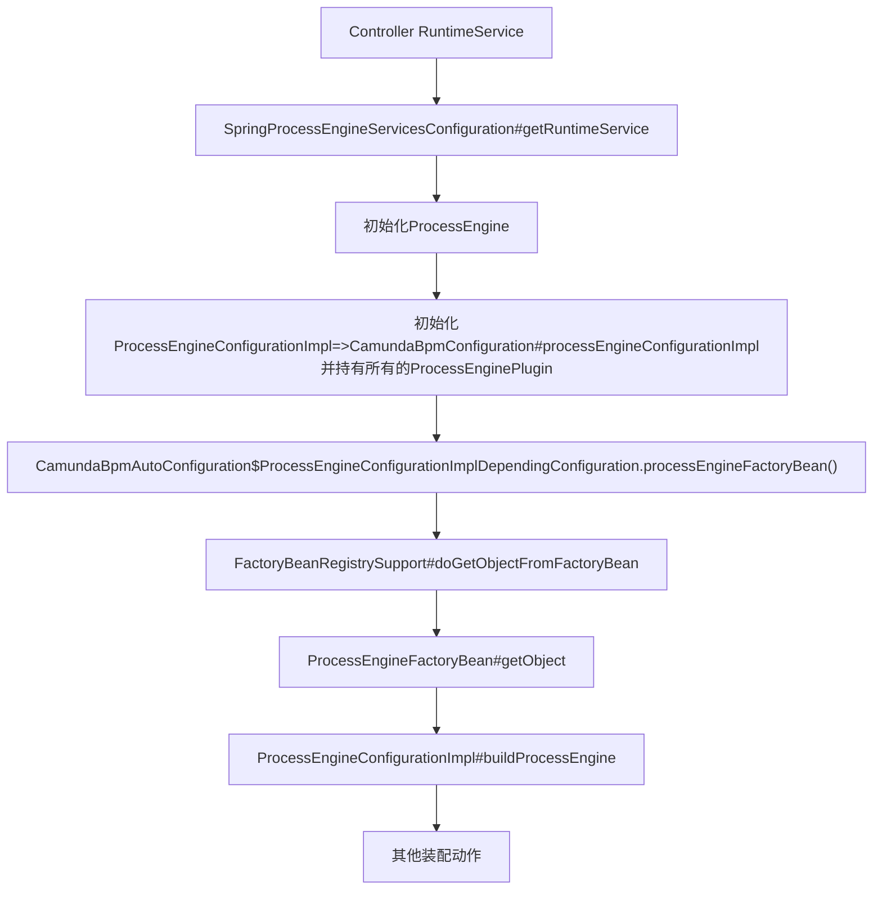

# Camunda

## bpmn调用过程

本部分内容使用：Camunda 7.23.0版本

```pom title="pom.xml" {4}
<dependency>
    <groupId>org.camunda.bpm.springboot</groupId>
    <artifactId>camunda-bpm-spring-boot-starter</artifactId>
    <version>7.23.0</version>
</dependency>
```

追踪调用过程使用[项目地址](https://github.com/Halcyon666/camunda-springboot)

### 启动过程

```java title="HelloProcessController" {4}
@RestController
public class HelloProcessController {

    private final RuntimeService runtimeService;
    private final TaskService taskService;
    // other codes ...
}
```

由于依赖了`RuntimeService`，触发SpringBoot自动装配Camunda相关的配置类。




:::info
总配置类 `org.camunda.bpm.spring.boot.starter.CamundaBpmAutoConfiguration`

在 `org.camunda.bpm.spring.boot.starter.CamundaBpmConfiguration` 中创建`ProcessEngineConfigurationImpl` 

⇒ `org.camunda.bpm.engine.impl.cfg.ProcessEngineConfigurationImpl` 主要是初始化一堆plugin

⇒ `org.camunda.bpm.engine.spring.ProcessEngineFactoryBean` 创建`org.camunda.bpm.engine.ProcessEngine`的`FactoryBean`，使用`ProcessEngineConfigurationImpl` 

构建引擎 `org.camunda.bpm.engine.impl.cfg.ProcessEngineConfigurationImpl#buildProcessEngine`

`org.camunda.bpm.engine.impl.cfg.ProcessEngineConfigurationImpl#invokePreInit`
:::

### Interceptor调用链分析

`org.camunda.bpm.engine.impl.cfg.ProcessEngineConfigurationImpl#getDefaultCommandInterceptorsTxRequired`
`public abstract class CommandInterceptor implements CommandExecutor`

`org.camunda.bpm.engine.impl.cfg.ProcessEngineConfigurationImpl`类中有一个属性
`protected List<CommandInterceptor> commandInterceptorsTxRequired;`, 所有这些`CommandInterceptors`都是`CommandExecutor`。

在 `org.camunda.bpm.engine.impl.cfg.ProcessEngineConfigurationImpl#initCommandExecutorTxRequired`  `Line 1586`行中初始化。
从后往前，把一个个Interceptor链接起来，然后将第一个赋值给commandExecutorTxRequiresNew。

```java title="ProcessEngineConfigurationImpl" 
/**
 * this will be initialized during the configurationComplete()
 */
protected CommandExecutor commandExecutorTxRequiresNew;
protected void initCommandExecutorTxRequired() {
  if (commandExecutorTxRequired == null) {
    commandExecutorTxRequired = initInterceptorChain(commandInterceptorsTxRequired);
  }
}
protected CommandInterceptor initInterceptorChain(List<CommandInterceptor> chain) {
  if (chain == null || chain.isEmpty()) {
    throw new ProcessEngineException("invalid command interceptor chain configuration: " + chain);
  }
  for (int i = 0; i < chain.size() - 1; i++) {
    chain.get(i).setNext(chain.get(i + 1));
  }
  return chain.get(0);
}
```

具体有哪些Interceptors呢？


### 初始化了哪些Service

```java title="ProcessEngineConfigurationImpl"
protected RepositoryService repositoryService = new RepositoryServiceImpl();
protected RuntimeService runtimeService = new RuntimeServiceImpl();
protected HistoryService historyService = new HistoryServiceImpl();
protected IdentityService identityService = new IdentityServiceImpl();
protected TaskService taskService = new TaskServiceImpl();
protected FormService formService = new FormServiceImpl();
protected ManagementService managementService = new ManagementServiceImpl(this);
protected AuthorizationService authorizationService = new AuthorizationServiceImpl();
protected CaseService caseService = new CaseServiceImpl();
protected FilterService filterService = new FilterServiceImpl();
protected ExternalTaskService externalTaskService = new ExternalTaskServiceImpl();
protected DecisionService decisionService = new DecisionServiceImpl();
protected OptimizeService optimizeService = new OptimizeService();
```

## 如何调用这个类

### 反射

<details>
    <summary>反射</summary>
```xml title="hello-process.bpmn"
<?xml version="1.0" encoding="UTF-8"?>
<definitions xmlns="http://www.omg.org/spec/BPMN/20100524/MODEL"
             xmlns:xsi="http://www.w3.org/2001/XMLSchema-instance"
             xmlns:camunda="http://camunda.org/schema/1.0/bpmn"
             targetNamespace="Examples">
  <process id="helloProcess"
           name="Hello Process"
           isExecutable="true"
           camunda:historyTimeToLive="180">
    <startEvent id="StartEvent_1" />
    <sequenceFlow id="flow1" sourceRef="StartEvent_1" targetRef="ServiceTask_1"/>
    <serviceTask id="ServiceTask_1"
                 name="Say Hello"
                 // highlight-next-line
                 camunda:class="com.example.camunda.delegate.HelloDelegate" />
    <sequenceFlow id="flow2" sourceRef="ServiceTask_1" targetRef="UserTask_1"/>
    <userTask id="UserTask_1" name="审批一下" />
    <sequenceFlow id="flow3" sourceRef="UserTask_1" targetRef="EndEvent_1"/>
    <endEvent id="EndEvent_1" />

  </process>
</definitions>
```

```java
@Slf4j
public class HelloDelegate implements JavaDelegate {
    @Override
    public void execute(DelegateExecution execution) {
        log.info("Hello from Camunda Delegate! processInstanceId={}", execution.getProcessInstanceId());
        execution.setVariable("greeting", "hello from delegate");
    }
}
```
</details>

`camunda:class="com.example.camunda.delegate.HelloDelegate"` 表明了通过反射调用，真实调用代码位置
`ClassDelegateActivityBehavior#getActivityBehaviorInstance(ActivityExecution)`

### 通过spring容器

- delegateExpression: 适合需要实现 JavaDelegate 接口的场景,更符合 Camunda 规范
`camunda:delegateExpression="${helloDelegate}"`

<details>
    <summary>delegateExpression</summary>
```xml title="hello-process.bpmn"
<?xml version="1.0" encoding="UTF-8"?>
<definitions xmlns="http://www.omg.org/spec/BPMN/20100524/MODEL"
             xmlns:xsi="http://www.w3.org/2001/XMLSchema-instance"
             xmlns:camunda="http://camunda.org/schema/1.0/bpmn"
             targetNamespace="Examples">
  <process id="helloProcess"
           name="Hello Process"
           isExecutable="true"
           camunda:historyTimeToLive="180">
    <startEvent id="StartEvent_1" />
    <sequenceFlow id="flow1" sourceRef="StartEvent_1" targetRef="ServiceTask_1"/>
    <serviceTask id="ServiceTask_1"
                 name="Say Hello"
                 camunda:delegateExpression="${helloDelegate}" />
    <sequenceFlow id="flow2" sourceRef="ServiceTask_1" targetRef="UserTask_1"/>
    <userTask id="UserTask_1" name="审批一下" />
    <sequenceFlow id="flow3" sourceRef="UserTask_1" targetRef="EndEvent_1"/>
    <endEvent id="EndEvent_1" />

  </process>
</definitions>
```

```java title="HelloDelegate"
@Slf4j
@Component
// highlight-next-line
public class HelloDelegate implements JavaDelegate {
    @Override
    public void execute(DelegateExecution execution) {
        log.info("Hello from Camunda Delegate! processInstanceId={}", execution.getProcessInstanceId());
        execution.setVariable("greeting", "hello from delegate");
    }
}
```
</details>

- expression: 更灵活,可以直接调用 Spring Bean 的任意方法,不需要实现特定接口
`camunda:expression="${helloDelegate1.sayHello(execution)}`

<details>
    <summary>expression方式</summary>
```xml title="hello-process.bpmn"
<?xml version="1.0" encoding="UTF-8"?>
<definitions xmlns="http://www.omg.org/spec/BPMN/20100524/MODEL"
             xmlns:xsi="http://www.w3.org/2001/XMLSchema-instance"
             xmlns:camunda="http://camunda.org/schema/1.0/bpmn"
             targetNamespace="Examples">

  <process id="helloProcess"
           name="Hello Process"
           isExecutable="true"
           camunda:historyTimeToLive="180">
    <startEvent id="StartEvent_1" />
    <sequenceFlow id="flow1" sourceRef="StartEvent_1" targetRef="ServiceTask_1"/>
    <serviceTask id="ServiceTask_1"
                 name="Say Hello"
                 // highlight-next-line
                 camunda:expression="${helloDelegate1.sayHello(execution)}" />
    <sequenceFlow id="flow2" sourceRef="ServiceTask_1" targetRef="UserTask_1"/>
    <userTask id="UserTask_1" name="审批一下" />
    <sequenceFlow id="flow3" sourceRef="UserTask_1" targetRef="EndEvent_1"/>
    <endEvent id="EndEvent_1" />
  </process>
</definitions>
```
```java
@Component title="HelloDelegate1"
public class HelloDelegate1 {
    private static final Logger log = LoggerFactory.getLogger(HelloDelegate1.class);
    // highlight-next-line
    public void sayHello(DelegateExecution execution) {
        // 使用注入的服务
        log.info("Hello from Camunda Delegate! processInstanceId={}", execution.getProcessInstanceId());
        execution.setVariable("greeting1", "hello from delegate");
    }
}

```
</details>

## 奇怪的debug手段

比如想在jar包中的AbstractEventAtomicOperation第50行打印控制台日志。

使用condition debug并且取消suspend。

界面效果如下:

```java
System.out.println(String.format("[%s] %s", ((org.camunda.bpm.engine.impl.pvm.runtime.PvmExecutionImpl)execution).getCurrentActivityId(), this.getClass().getSimpleName())) == null
```


## 状态机状态转化过程 

```log
performOperation(CoreAtomicOperation):609, ExecutionEntity (org.camunda.bpm.engine.impl.persistence.entity), ExecutionEntity.java
// highlight-start
callback(PvmExecutionImpl):75, PvmAtomicOperationProcessStart$2 (org.camunda.bpm.engine.impl.pvm.runtime.operation), PvmAtomicOperationProcessStart.java
callback(Object):70, PvmAtomicOperationProcessStart$2 (org.camunda.bpm.engine.impl.pvm.runtime.operation), PvmAtomicOperationProcessStart.java
continueIfExecutionDoesNotAffectNextOperation(Callback, Callback, PvmExecutionImpl):2109, PvmExecutionImpl (org.camunda.bpm.engine.impl.pvm.runtime), PvmExecutionImpl.java
eventNotificationsCompleted(PvmExecutionImpl):64, PvmAtomicOperationProcessStart (org.camunda.bpm.engine.impl.pvm.runtime.operation), PvmAtomicOperationProcessStart.java
eventNotificationsCompleted(CoreExecution):30, PvmAtomicOperationProcessStart (org.camunda.bpm.engine.impl.pvm.runtime.operation), PvmAtomicOperationProcessStart.java
execute(CoreExecution):70, AbstractEventAtomicOperation (org.camunda.bpm.engine.impl.core.operation), AbstractEventAtomicOperation.
// highlight-end
execute(BpmnStackTrace, ProcessDataContext):99, AtomicOperationInvocation (org.camunda.bpm.engine.impl.interceptor), AtomicOperationInvocation.java
invokeNext():141, CommandInvocationContext (org.camunda.bpm.engine.impl.interceptor), CommandInvocationContext.java
performNext():128, CommandInvocationContext (org.camunda.bpm.engine.impl.interceptor), CommandInvocationContext.java
performOperation(AtomicOperation, ExecutionEntity, boolean):96, CommandInvocationContext (org.camunda.bpm.engine.impl.interceptor), CommandInvocationContext.java [1]
performOperation(AtomicOperation):635, ExecutionEntity (org.camunda.bpm.engine.impl.persistence.entity), ExecutionEntity.java
performOperation(CoreAtomicOperation):609, ExecutionEntity (org.camunda.bpm.engine.impl.persistence.entity), ExecutionEntity.java
start(Map, VariableMap):294, PvmExecutionImpl (org.camunda.bpm.engine.impl.pvm.runtime), PvmExecutionImpl.java
```

### start-hello task

<details>
    <summary>Controler接口</summary>
```java
package com.example.camunda.web;

import org.camunda.bpm.engine.RuntimeService;
import org.camunda.bpm.engine.TaskService;
import org.camunda.bpm.engine.runtime.ProcessInstance;
import org.camunda.bpm.engine.task.Task;
import org.springframework.web.bind.annotation.*;

import java.util.List;

@RestController
public class HelloProcessController {

    private final RuntimeService runtimeService;
    private final TaskService taskService;

    public HelloProcessController(RuntimeService runtimeService, TaskService taskService) {
        this.runtimeService = runtimeService;
        this.taskService = taskService;
    }

    // 启动流程
    @GetMapping("/start-hello")
    public String startHelloProcess() {
        ProcessInstance instance = runtimeService.startProcessInstanceByKey("helloProcess");
        return "流程启动成功，实例ID: " + instance.getId();
    }

    // 查询当前待办任务
    @GetMapping("/tasks")
    public String listTasks() {
        List<Task> tasks = taskService.createTaskQuery().list();
        if (tasks.isEmpty()) {
            return "当前没有待办任务";
        }
        StringBuilder sb = new StringBuilder("待办任务列表：\n");
        for (Task task : tasks) {
            sb.append("任务ID=").append(task.getId())
              .append(", 名称=").append(task.getName())
              .append(", 流程实例ID=").append(task.getProcessInstanceId())
              .append("\n");
        }
        return sb.toString();
    }

    // 完成任务
    @PostMapping("/complete/{taskId}")
    public String completeTask(@PathVariable String taskId) {
        taskService.complete(taskId);
        return "任务已完成: " + taskId;
    }
}
```
</details>

```shell 
GET http://localhost:8080/start-hello
```
在 `org.camunda.bpm.engine.impl.persistence.entity.ExecutionEntity#performOperation(org.camunda.bpm.engine.impl.core.operation.CoreAtomicOperation<T>)` <br/>
处使用条件断点,断点打印信息如下
```java
System.out.println(String.format("[ActivityId: %s] Operation: %s, Thread: %s", 
    this.activityId != null ? this.activityId : "ROOT",
    operation.getClass().getSimpleName(),
    Thread.currentThread().getName())) == null
```

```log title="start-hello 去重之后的日志"
[ActivityId: StartEvent_1] Operation: PvmAtomicOperationProcessStart, Thread: http-nio-8080-exec-7
[ActivityId: StartEvent_1] Operation: PvmAtomicOperationActivityStartCreateScope, Thread: http-nio-8080-exec-7
[ActivityId: StartEvent_1] Operation: PvmAtomicOperationActivityStart, Thread: http-nio-8080-exec-7
[ActivityId: StartEvent_1] Operation: PvmAtomicOperationActivityExecute, Thread: http-nio-8080-exec-7
[ActivityId: StartEvent_1] Operation: PvmAtomicOperationActivityLeave, Thread: http-nio-8080-exec-7
[ActivityId: StartEvent_1] Operation: PvmAtomicOperationTransitionNotifyListenerEnd, Thread: http-nio-8080-exec-7
[ActivityId: StartEvent_1] Operation: PvmAtomicOperationTransitionDestroyScope, Thread: http-nio-8080-exec-7
[ActivityId: StartEvent_1] Operation: PvmAtomicOperationTransitionNotifyListenerTake, Thread: http-nio-8080-exec-7
[ActivityId: ServiceTask_1] Operation: PvmAtomicOperationTransitionCreateScope, Thread: http-nio-8080-exec-7
[ActivityId: ServiceTask_1] Operation: PvmAtomicOperationTransitionNotifyListenerStart, Thread: http-nio-8080-exec-7
[ActivityId: ServiceTask_1] Operation: PvmAtomicOperationActivityExecute, Thread: http-nio-8080-exec-7
[ActivityId: ServiceTask_1] Operation: PvmAtomicOperationActivityLeave, Thread: http-nio-8080-exec-7
[ActivityId: ServiceTask_1] Operation: PvmAtomicOperationTransitionNotifyListenerEnd, Thread: http-nio-8080-exec-7
[ActivityId: ServiceTask_1] Operation: PvmAtomicOperationTransitionDestroyScope, Thread: http-nio-8080-exec-7
[ActivityId: ServiceTask_1] Operation: PvmAtomicOperationTransitionNotifyListenerTake, Thread: http-nio-8080-exec-7
[ActivityId: UserTask_1] Operation: PvmAtomicOperationTransitionCreateScope, Thread: http-nio-8080-exec-7
[ActivityId: UserTask_1] Operation: PvmAtomicOperationTransitionNotifyListenerStart, Thread: http-nio-8080-exec-7
[ActivityId: UserTask_1] Operation: PvmAtomicOperationActivityExecute, Thread: http-nio-8080-exec-7
```

### complete task

```shell
POST http://localhost:8080/complete/55e03f1c-a5f7-11f0-9020-b05cda36f80c
Content-Type: application/x-www-form-urlencoded
```

```log title="complete 去重之后的日志"
[ActivityId: UserTask_1] Operation: PvmAtomicOperationActivityLeave, Thread: http-nio-8080-exec-10
[ActivityId: UserTask_1] Operation: PvmAtomicOperationTransitionNotifyListenerEnd, Thread: http-nio-8080-exec-10
[ActivityId: UserTask_1] Operation: PvmAtomicOperationTransitionDestroyScope, Thread: http-nio-8080-exec-10
[ActivityId: UserTask_1] Operation: PvmAtomicOperationTransitionNotifyListenerTake, Thread: http-nio-8080-exec-10
[ActivityId: EndEvent_1] Operation: PvmAtomicOperationTransitionCreateScope, Thread: http-nio-8080-exec-10
[ActivityId: EndEvent_1] Operation: PvmAtomicOperationTransitionNotifyListenerStart, Thread: http-nio-8080-exec-10
[ActivityId: EndEvent_1] Operation: PvmAtomicOperationActivityExecute, Thread: http-nio-8080-exec-10
[ActivityId: EndEvent_1] Operation: PvmAtomicOperationActivityNotifyListenerEnd, Thread: http-nio-8080-exec-10
[ActivityId: EndEvent_1] Operation: PvmAtomicOperationActivityEnd, Thread: http-nio-8080-exec-10
[ActivityId: EndEvent_1] Operation: PvmAtomicOperationProcessEnd, Thread: http-nio-8080-exec-10
```

import TailProtocal from '@site/src/components/TailProtocal'

<TailProtocal />
