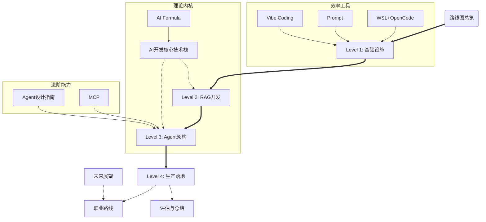

# AI Engineering Roadmap: 核心脉络与依赖上下文

> 本文档梳理了知识库的核心依赖关系，作为图谱的文字版导航。

## 🚀 核心主航道 (The Golden Path)
建议按以下严格顺序进阶，每一层都是下一层的基石：

1.  **Level 1: AI-Native 基础设施**
    *   **定位**: 搭建环境，学会 "Vibe Coding"（直觉编程）。
    *   **依赖**: `WSL + OpenCode`, `Prompt`, `Vibe Coding`
2.  **Level 2: RAG 与 异构架构**
    *   **定位**: 让 AI 挂载外部知识库，解决幻觉。
    *   **依赖**: Level 1 (环境), `AI开发核心技术栈` (理论)
3.  **Level 3: Agent 智能体与编排**
    *   **定位**: 从"单次问答"进化为"自主决策任务"。
    *   **依赖**: Level 2 (检索能力), `MCP` (工具协议)
    *   **核心**: `Agent 智能体设计指南`
4.  **Level 4: 全栈落地与 LLMOps**
    *   **定位**: 生产级交付，监控、微调、高并发。
    *   **依赖**: Level 3
    *   **出口**: `Career Paths` (职业选择), `Summary` (面试/总结)

## 🧩 知识图谱结构 (Mermaid)

