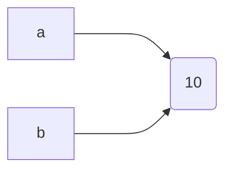
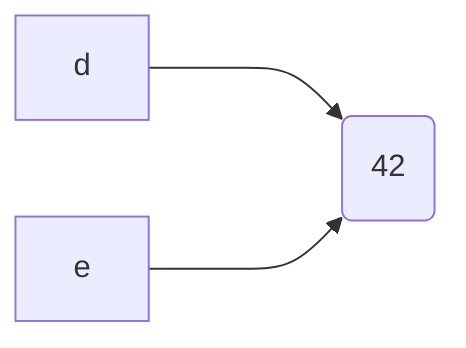

> This file notes all the useful websites. Once browser bookmarks are lost, I can find back all the sites that I need.

## Links

[CircleCI Automated Deployment](https://zhuanlan.zhihu.com/p/370550987)

[Alibaba Cloud Docker Quick Installation](https://www.cnblogs.com/hongmaju/p/15598990.html)

[Docker Compose Installation](https://www.cnblogs.com/lihw-study/p/16022277.html)

[ssh: connect to host github.com port 22: Connection timed out](https://blog.csdn.net/hdm314/article/details/119947761)

[CLion MinGW Environment Configuration](https://zhuanlan.zhihu.com/p/43680621)

[18 Types of Locks in Java](https://mp.weixin.qq.com/s/QYJLQN2XsI88Gh0xOxS4MA)

[Nacos Principles](https://mp.weixin.qq.com/s/4QgQ1h9VSJZ4c2tFDm6log)

[Accelerating Spring Startup Speed](https://mp.weixin.qq.com/s/ZMIUXDc7yY64GDE70g3-kA)

[Overall Technical Architecture of Dubbo Mesh](https://www.alibabacloud.com/blog/overall-technical-architecture-of-dubbo-mesh_600029)

multiple deployment modes (SDK, Sidecar, and Agent)

[Seata Distributed Transactions](https://mp.weixin.qq.com/s/cM8XUouYGnUVYwm1qgUqVQ)

> In `Java`, if an abstract class or entity class that is not managed by a container is inherited by an entity class managed by a container, then the abstract class will also be automatically managed by the container.

[Docusaurus Website Building (2) - Deploy to GitHub Pages](https://juejin.cn/post/7115631818736402440)

[@ConditionalOnProperty](https://blog.csdn.net/winterking3/article/details/114822929)

## Deep Understanding of Apache Dubbo and Practice

- Chapter 3
FailbackRegistry inherits from AbstractRegistry, overrides the parent class's registration, subscription, query and notification methods, and adds retry mechanisms. In addition, it also adds four unimplemented abstract template methods.

Although each registry has its own specific factory class, where is it determined which factory class implementation should be called? There is no explicit judgment seen in the code. The answer lies in the RegistryFactory interface, which has a Registry getRegistry(URL url) method with @Adaptive({"protocol"}) annotation.

Dubbo's excellent extensibility is inseparable from two aspects: first, the entire framework appropriately uses various design patterns for different scenarios, and second is the loading mechanism introduced in this chapter.


## Mermaid Example

> [This code from](https://juejin.cn/post/7038144693867118629)

import Tabs from '@theme/Tabs';
import TabItem from '@theme/TabItem';

# Mermaid in tabs
  
<!-- [start] add this to avoid the possible bug. Note: the empty line before [```] is necessary -->
```mermaid
flowchart TD

```
<!-- [end] add this to avoid the possible bug -->


<Tabs>
<TabItem value="tab-a">



</TabItem>

<TabItem value="tab-b">



</TabItem>
</Tabs>
