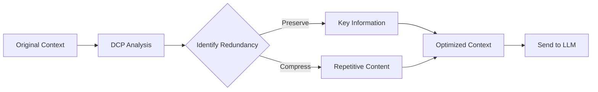
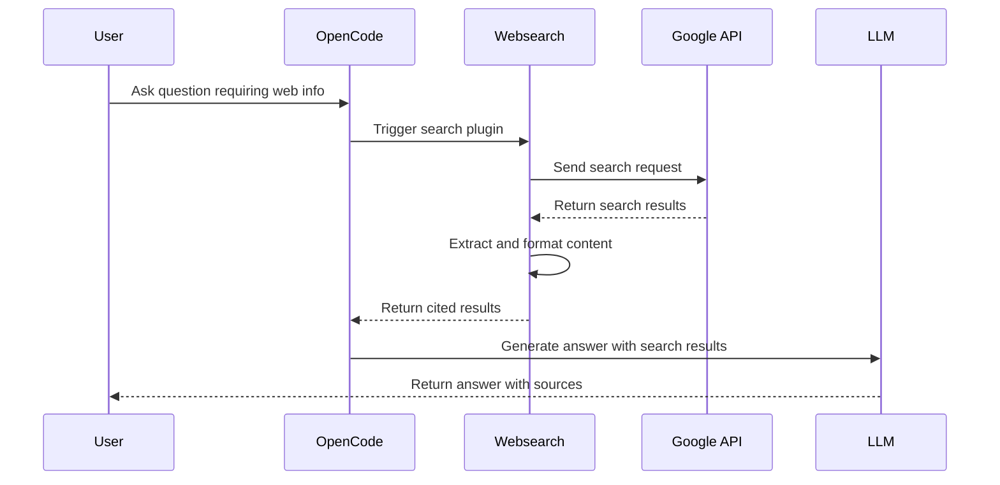
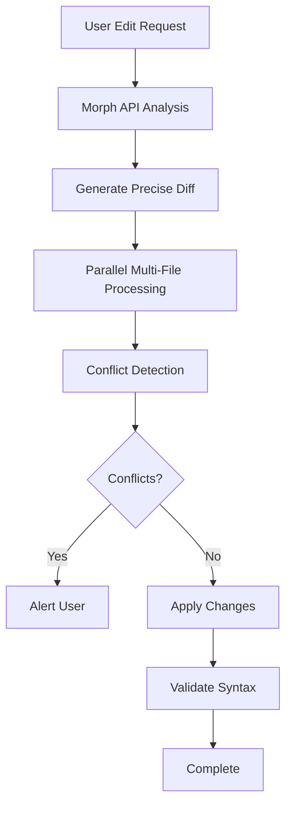
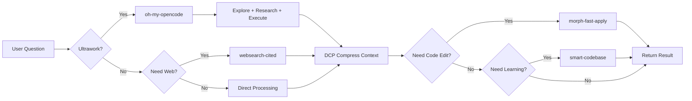

# OpenCode Plugin Ecosystem

OpenCode achieves powerful extensibility through its plugin system. This guide covers six core plugins that solve multi-model orchestration, context management, web search, code editing, knowledge learning, and authentication challenges.

## Core Plugins Overview

| Plugin | Purpose | Source | Key Features |
|---|---|---|---|
| `oh-my-opencode` | Multi-model orchestration, sub-agent execution, autonomous workflows | npm | Professional agent orchestration |
| `@tarquinen/opencode-dcp` | Auto-compress redundant context, save tokens | npm | Intelligent context compression |
| `opencode-websearch-cited` | Web search with Google Search API | npm | Real-time information retrieval |
| `morph-fast-apply` | Ultra-fast code editing (10,500+ tokens/s, 98% accuracy) | GitHub | High-speed code application |
| `smart-codebase` | AI learns from sessions and code, generates SKILL files | npm | Continuous knowledge accumulation |
| `opencode-openai-codex-auth` | OpenAI OAuth authentication | npm | Secure authentication |

---

## 1. oh-my-opencode

**Detailed installation and configuration guide**: [oh-my-opencode Installation Guide](./oh-my-opencode-installation-guide)

### Core Capabilities

- **Multi-Agent Architecture**: Built-in agents like Explore, Oracle, Librarian, Sisyphus for specialized tasks
- **Category Routing**: Automatically selects optimal model based on task type
- **Ultrawork Mode**: `/ulw` keyword triggers autonomous work
- **Prometheus Planning**: Automatic decomposition, planning, and execution for complex projects
- **Skills System**: Built-in skills like `playwright`, `frontend-ui-ux`, `git-master`

### Installation

```bash
npm install oh-my-opencode@latest
# or
bun add oh-my-opencode
```

---

## 2. @tarquinen/opencode-dcp

### Overview

**DCP (Dynamic Context Pruning)** is an intelligent context management plugin that optimizes token usage through automatic compression and redundancy elimination.

### Core Capabilities

- **Automatic Context Compression**: Identifies and compresses repetitive or redundant conversation history
- **Smart Key Information Retention**: Preserves context critical to current tasks
- **Token Optimization**: Significantly reduces API call costs
- **Transparent Operation**: Works automatically in the background without manual intervention

### Installation

```bash
cd ~/.config/opencode
npm install @tarquinen/opencode-dcp@latest
```

### Use Cases

- **Long Conversations**: Auto-compresses when conversation history exceeds thousands of tokens
- **Multi-Round Iterations**: Saves costs in tasks requiring multiple interactions like code refactoring
- **Large Projects**: Maintains performance when handling projects with extensive file context

### How It Works



### Configuration Example

DCP typically requires no additional configuration and auto-enables after installation. For custom behavior, add to `opencode.json`:

```json
{
  "plugins": {
    "@tarquinen/opencode-dcp": {
      "enabled": true,
      "compressionThreshold": 8000,
      "preserveRecentMessages": 10
    }
  }
}
```

---

## 3. opencode-websearch-cited

### Overview

**Websearch Cited** provides real-time web search capabilities for OpenCode, fetching latest information via Google Search API with cited sources.

### Core Capabilities

- **Real-Time Information Retrieval**: Access to latest web information
- **Source Citation**: Every information point includes verifiable source links
- **Intelligent Summarization**: Automatically extracts and summarizes search results
- **Multi-Language Support**: Supports Chinese, English, and other languages

### Installation

```bash
cd ~/.config/opencode
npm install opencode-websearch-cited@latest
```

### Configuration Requirements

Requires Google Search API credentials:

```bash
# Method 1: Environment variables
export GOOGLE_SEARCH_API_KEY="your-api-key"
export GOOGLE_SEARCH_ENGINE_ID="your-engine-id"

# Method 2: Write to .env file
echo "GOOGLE_SEARCH_API_KEY=your-api-key" >> ~/.config/opencode/.env
echo "GOOGLE_SEARCH_ENGINE_ID=your-engine-id" >> ~/.config/opencode/.env
```

### Use Cases

#### Scenario 1: Technical Queries

```
User: Search for React 19 latest features

Agent: [Calling websearch-cited]
Based on search results, React 19 introduces:
1. **React Compiler**: Automatic component performance optimization [Source: react.dev]
2. **Actions**: Simplified form handling and data submission [Source: github.com/facebook/react]
3. **Document Metadata**: Native support for <title> and <meta> tags [Source: react.dev/blog]
```

#### Scenario 2: Market Research

```
User: Find 2025 AI coding tools market trends

Agent: [Calling websearch-cited]
Current AI coding tools market shows:
- GitHub Copilot leads market share [Source: stackoverflow.com/survey]
- Cursor and Windsurf growing rapidly [Source: techcrunch.com]
- Enterprise adoption up 40% [Source: gartner.com]
```

### Workflow



### Best Practices

1. **Clear Search Intent**: Use specific keywords rather than vague descriptions
2. **Verify Sources**: Check authority of cited links
3. **Consider Timeliness**: For rapidly changing tech, prioritize recent results
4. **Combine Knowledge**: Merge search results with local knowledge for comprehensive answers

---

## 4. morph-fast-apply

### Overview

**Morph Fast Apply** is a revolutionary code editing plugin achieving ultra-fast code application through Morph LLM's dedicated API, reaching **10,500+ tokens/s** with **98% accuracy**.

### Core Capabilities

- **Ultra-Fast Editing**: 10-50x faster than traditional methods
- **High Accuracy**: 98% code application success rate
- **Intelligent Diff**: Precisely identifies code segments needing modification
- **Batch Operations**: Supports simultaneous multi-file editing
- **Conflict Detection**: Automatically detects and alerts potential code conflicts

### Technical Advantages

| Feature | Traditional Editing | Morph Fast Apply |
|---|---|---|
| Speed | 200-500 tokens/s | 10,500+ tokens/s |
| Accuracy | 85-90% | 98% |
| Multi-File Support | Limited | Native |
| Conflict Detection | Manual | Automatic |
| Large File Handling | Difficult | Optimized |

### Installation

```bash
# Clone plugin repository
mkdir -p ~/.config/opencode/plugins
git clone https://github.com/JRedeker/opencode-morph-fast-apply ~/.config/opencode/plugins/morph-fast-apply

# Install dependencies
cd ~/.config/opencode/plugins/morph-fast-apply
npm install
```

### Configure API Key

Visit [Morph Dashboard](https://morphllm.com/dashboard) to obtain API Key:

```bash
# Method 1: Environment variable (recommended)
# macOS/Linux
echo 'export MORPH_API_KEY="your-morph-api-key"' >> ~/.bashrc  # or ~/.zshrc
source ~/.bashrc

# Windows PowerShell (Administrator)
[System.Environment]::SetEnvironmentVariable("MORPH_API_KEY", "your-key", "User")

# Method 2: Write to .env file
echo "MORPH_API_KEY=your-morph-api-key-here" >> ~/.config/opencode/.env
```

### Use Cases

#### Scenario 1: Large-Scale Refactoring

```
User: Refactor all class components to function components in the project

Agent: [Using morph-fast-apply]
✓ Analyzed 45 component files
✓ Identified 23 class components
✓ Batch converting...
✓ Complete! Average 0.3 seconds per file
```

#### Scenario 2: API Upgrade

```
User: Upgrade all React Router v5 code to v6 syntax

Agent: [Using morph-fast-apply]
✓ Detected 18 route files
✓ Convert <Switch> to <Routes>
✓ Update <Route> component syntax
✓ Change useHistory to useNavigate
✓ All files updated, no conflicts
```

#### Scenario 3: Code Style Unification

```
User: Unify import statement order across project (React -> Third-party -> Local)

Agent: [Using morph-fast-apply]
✓ Scanned 127 files
✓ Reordered imports in 89 files
✓ Preserved all functionality
✓ Completed in 8 seconds
```

### How It Works



### Performance Comparison

Real test data (based on 50-file refactoring task):

```
Traditional Method:
- Total time: ~5 minutes
- Success rate: 87%
- Manual fixes needed: 6 files

Morph Fast Apply:
- Total time: ~15 seconds
- Success rate: 98%
- Manual fixes needed: 1 file
```

### Best Practices

1. **Test Small First**: Test on small scope before large-scale application
2. **Use Version Control**: Ensure all changes are under Git management for easy rollback
3. **Batch Processing**: For huge projects (1000+ files), process in batches
4. **Verify Build**: Run tests and build immediately after applying changes
5. **Review Diff**: Manually review diffs for critical code modifications

---

## 5. smart-codebase

### Overview

**Smart-Codebase** is a knowledge accumulation plugin that enables OpenCode to learn from every session and codebase, automatically generating SKILL files. New sessions automatically load project context without repetitive explanations.

### Core Capabilities

- **Auto Learning**: Extracts knowledge from sessions, automatically writes SKILL files
- **sc-init**: Scans source code, generates project skill files
- **sc-update**: Analyzes current session, updates skill library
- **Structured Storage**: SKILL.md + reference/*.md layered organization
- **Cross-Session Persistence**: Knowledge saved in files, auto-loaded in next session

### Installation

```bash
cd ~/.config/opencode
npm install smart-codebase@latest

# or using bun (recommended)
bun add smart-codebase
```

### Usage

```bash
# Run slash commands in OpenCode
/sc-init      # Initialize project skills
/sc-update    # Extract knowledge from current session
```

### File Structure

```
~/.config/opencode/skills/
└── <project-name>/
    ├── SKILL.md           # Main skill file (auto-discovered)
    └── reference/
        ├── architecture.md  # Architecture documentation
        ├── patterns.md      # Pattern documentation
        └── gotchas.md       # Pitfall guide
```

### Workflow

```mermaid
graph TB
    A[Working Session] --> B{Need Init?}
    B -->|Yes| C[/sc-init]
    B -->|No| D[Continue Working]
    D --> E[/sc-update]
    C --> F[AI Scans Source Code]
    E --> G[AI Analyzes Session]
    F --> H[Generate SKILL Files]
    G --> I[Update SKILL Files]
    H --> J[New Session Starts]
    I --> J
    J --> K[Auto-Load Skills]
```

### Best Practices

1. **First Project**: Run `/sc-init` to establish baseline
2. **Milestone Moments**: Run `/sc-update` to save important decisions
3. **Knowledge Layering**: Summary in SKILL.md, details in reference/
4. **Manual Review**: Regularly review generated skill files

---

## 6. opencode-openai-codex-auth

### Overview

**OpenAI Codex Auth** provides OpenAI OAuth authentication support for OpenCode's GPT model calls.

### Installation

```bash
cd ~/.config/opencode
npm install opencode-openai-codex-auth
```

### Configuration

After installation, run:

```bash
opencode providers
```

Select OpenAI provider and complete OAuth authentication flow.

---

## Plugin Synergy

These six plugins work together seamlessly to form powerful workflows:

### Typical Workflow Example



### Real-World Case: Complex Project Refactoring

```
User: Refactor my e-commerce backend, referencing latest microservice best practices

Step 1: [oh-my-opencode Planning]
→ Prometheus analyzes project structure
→ Generate refactoring plan

Step 2: [websearch-cited Search]
→ Get microservice architecture best practices
→ Get relevant technical documentation

Step 3: [DCP Compression]
→ Compress search results
→ Retain key migration steps

Step 4: [morph-fast-apply Execution]
→ Batch update code
→ Preserve functionality

Step 5: [smart-codebase Learning]
→ /sc-update saves decisions
→ Next session auto-loads

Result: Complete tech stack refactoring in < 10 minutes
```

---

## Plugin Comparison & Selection

### Feature Matrix

| Use Case | Recommended Plugin | Reason |
|---|---|---|
| Multi-model orchestration/sub-agents | oh-my-opencode | Professional agent orchestration |
| Long conversation optimization | DCP | Auto-manages context, reduces costs |
| Need latest information | websearch-cited | Real-time web search |
| Large-scale code changes | morph-fast-apply | Fast with high accuracy |
| Knowledge accumulation/learning | smart-codebase | Auto-learn from sessions |
| Technical research | websearch-cited | Authoritative sources |
| Code refactoring | morph-fast-apply | Strong batch processing |
| Token cost control | DCP | Intelligent redundancy compression |
| OpenAI authentication | openai-codex-auth | OAuth secure auth |
| Autonomous work | oh-my-opencode | Ultrawork mode |

### Cost-Benefit Analysis

```
Scenario: Handle refactoring task with 100 files

Without Plugins:
- Time cost: ~2 hours
- Token cost: ~500K tokens ($10)
- Manual fixes: ~30 minutes

With Plugin Combo:
- Time cost: ~5 minutes
- Token cost: ~50K tokens ($1)
- Manual fixes: ~5 minutes

Savings: 95% time + 90% cost
```

---

## Complete Installation & Configuration Guide

### One-Click Install Script

```bash
#!/bin/bash
# install-opencode-plugins.sh

echo "🚀 Starting OpenCode core plugins installation..."

# Enter config directory
cd ~/.config/opencode || exit

# Install npm plugins
echo "📦 Installing npm plugins..."
npm install @tarquinen/opencode-dcp@latest \
            opencode-websearch-cited@latest \
            smart-codebase@latest

# Install morph-fast-apply
echo "📦 Installing morph-fast-apply..."
mkdir -p plugins
git clone https://github.com/JRedeker/opencode-morph-fast-apply plugins/morph-fast-apply
cd plugins/morph-fast-apply
npm install

# oh-my-opencode detailed config in ./oh-my-opencode-installation-guide
npm install oh-my-opencode@latest

# Symlink smart-codebase to plugins (if needed)
ln -sf ../node_modules/smart-codebase plugins/smart-codebase

echo "✅ All plugins installed!"
echo "⚠️  Please configure these environment variables:"
echo "   - MORPH_API_KEY (required for morph-fast-apply)"
echo "   - GOOGLE_SEARCH_API_KEY (optional for websearch)"
echo "   - GOOGLE_SEARCH_ENGINE_ID (optional for websearch)"
```

### Verify Installation

```bash
# Check plugin loading status
opencode debug config | grep -A 10 "plugins"

# Test DCP
opencode run "Long conversation test"

# Test websearch-cited
opencode run "Search latest AI news"

# Test morph-fast-apply
opencode run "Create a simple React component"

# Initialize smart-codebase (first time)
opencode run "/sc-init"
```

---

## FAQ

### Q1: Will DCP lose important context?

**A:** No. DCP uses intelligent algorithms to identify key information, only compressing truly redundant content. If concerned, adjust the `preserveRecentMessages` parameter.

### Q2: Does websearch-cited require payment?

**A:** Google Search API has free quota (100 queries/day), payment required beyond that. Usually sufficient for personal use.

### Q3: What's the API cost for morph-fast-apply?

**A:** Morph API charges by token, but due to extreme speed, actual cost is typically lower than using general LLM multi-turn conversations.

### Q4: Which models do these plugins support?

**A:** 
- DCP, websearch-cited, smart-codebase: Support all OpenCode-compatible models
- morph-fast-apply: Uses dedicated Morph API, independent of main model
- oh-my-opencode: Selects different models based on configuration (GPT, Claude, Gemini, etc.)

### Q5: Can I install only some plugins?

**A:** Yes. These six plugins are completely independent and can be selectively installed based on needs.

### Q6: What's the difference between smart-codebase and oh-my-opencode's knowledge systems?

**A:** 
- **smart-codebase**: Extracts knowledge from current session, automatically generates SKILL files. Suitable for project-level knowledge accumulation.
- **oh-my-opencode**: Built-in skills system with preset skills like `playwright`, `frontend-ui-ux`. Suitable for cross-project reuse.

The two can be used together: oh-my-opencode provides base skills, smart-codebase supplements project-specific knowledge.

---

## Advanced Tips

### Tip 1: Customize DCP Compression Strategy

```json
{
  "plugins": {
    "@tarquinen/opencode-dcp": {
      "compressionThreshold": 6000,
      "preserveRecentMessages": 15,
      "aggressiveMode": false,
      "preserveCodeBlocks": true
    }
  }
}
```

### Tip 2: Configure Websearch Preferences

```json
{
  "plugins": {
    "opencode-websearch-cited": {
      "maxResults": 10,
      "language": "en-US",
      "safeSearch": "moderate",
      "dateRestrict": "m1"  // Only search last month
    }
  }
}
```

### Tip 3: Optimize morph-fast-apply Performance

```json
{
  "plugins": {
    "morph-fast-apply": {
      "maxConcurrentFiles": 10,
      "timeout": 30000,
      "retryOnFailure": true,
      "validateSyntax": true
    }
  }
}
```

---

## Summary

These six core plugins represent the powerful extensibility of the OpenCode ecosystem:

- **oh-my-opencode**: Multi-model orchestration, sub-agent execution, Ultrawork autonomous work
- **@tarquinen/opencode-dcp**: Makes long conversations more economical and efficient
- **opencode-websearch-cited**: Connects to real-time internet knowledge
- **morph-fast-apply**: Elevates code editing speed to new heights
- **smart-codebase**: Enables AI to continuously learn from sessions
- **opencode-openai-codex-auth**: Secure OAuth authentication

By properly combining these plugins, you can build extremely efficient AI-assisted development workflows, dramatically reducing time and cost investment while maintaining high-quality output.

---

## Related Resources

- [OpenCode Official Documentation](https://opencode.dev)
- [oh-my-opencode Detailed Guide](./oh-my-opencode-installation-guide)
- [Morph LLM Dashboard](https://morphllm.com/dashboard)
- [Google Custom Search API](https://developers.google.com/custom-search)
- [OpenCode Skills Ecosystem](./owesome-ai-skills)
