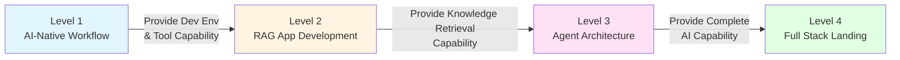

# AI Prompt Engineering & Full Stack Development Roadmap

## Document Positioning and Usage Instructions

**Target Audience**: Developers with at least one programming language foundation (Python/Java/JavaScript) who wish to systematically master AI capabilities.

**Core Goal**: Centering on **Generating High Quality Prompts**, help developers grow from tool users to Full Stack Engineers capable of designing enterprise-grade AI systems.

**Learning Path**: Level 1 (Tool Driven) → Level 2 (RAG Application) → Level 3 (Agent Architecture) → Level 4 (Production Deployment), each phase 2-3 weeks, total 9-12 weeks.

## Core Philosophy

### Design Principles

1. ⭐ **Architecture Patterns Priority over Tool Learning**: Understand Sidecar Pattern, Async Decoupling, Structured Output and other architecture patterns.
2. **Extensions over Deep Dives**: Treat platforms like Dify as black boxes, focus on extension and integration.
3. ⭐ **Evaluation Shift Left**: Establish Golden Dataset and Automated Evaluation from early stage.
4. **Observability**: Establish complete Agent behavior tracking and quality monitoring system.
5. ⭐ **Dual Track Parallel**: Master both rapid delivery tools (Dify) and deep customization capabilities (LangGraph).

### Technical Route Dual Track System

- ⭐ **Productivity Track (80% Scenarios)**: Dify, Ollama, MCP —— Quickly solve general needs.
- **Hard Power Track (20% Core Challenges)**: PyTorch, LangGraph, VectorDB —— Conquer complex problems.

## Capability Evolution Path

## Quick Navigation

| Phase | Cycle | Core Goal | Priority |
|------|------|----------|--------|
| ⭐ [Level 1: AI-Native Workflow](./level-1-ai-native) | Weeks 1-2 | Establish AI-first development habits, build local AI infrastructure | Must Learn First |
| ⭐ [Level 2: RAG App Development](./level-2-rag) | Weeks 3-5 | Master Retrieval-Augmented Generation (RAG), understand heterogeneous system architecture | Core Capability |
| [Level 3: Agent Architecture](./level-3-agent) | Weeks 6-8 | Master Intelligent Decision & Routing, establish observability and auditing capability | Advanced |
| [Level 4: Full Stack Landing](./level-4-production) | Weeks 9-12 | Complete Frontend & Backend Full Stack Delivery, master model fine-tuning and production deployment | Senior |
| [Prompt Quality Evaluation & Summary](./summary) | - | Prompt quality standards, skill combinations, interview crash list | Reference |

## Critical Success Factors

1. ⭐ **Architecture Patterns Priority over Tool Learning**: Understand Sidecar Pattern, Async Decoupling, Structured Output and other architecture patterns.
2. **Extensions over Deep Dives**: Treat platforms like Dify as black boxes, focus on extension and integration.
3. ⭐ **Evaluation Shift Left**: Establish Golden Dataset and Automated Evaluation starting from Level 2.
4. **Observability**: Establish complete Agent behavior tracking and quality monitoring system.
5. ⭐ **Dual Track Parallel**: Master both rapid delivery tools (Dify) and deep customization capabilities (LangGraph).

> Your **Java/React Experience** determines how **Stable** you can build the system (Complex Architecture Capability), while your **AI Tool Driving Capability** determines how **Fast** you can run (Development Efficiency).
>
> **Adding these two together makes a true Full Stack AI Engineer.**
