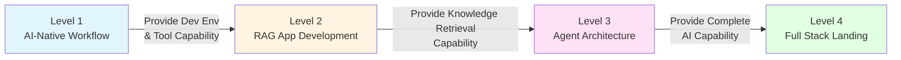

# Prompt Quality Evaluation & Summary

## ⭐ Prompt Quality Evaluation Standards

A high quality Prompt should meet:

### ⭐ 1. Clarity

- ⭐ Clearly define role (You are a...)
- ⭐ Clear task (Requirement:...)
- Specify output format (Please generate...)

### ⭐ 2. Context Completeness

- Provide sufficient background information
- ⭐ Include relevant code snippets, error logs, business rules
- Explain tech stack and environment

### 3. Verifiability

- Output results can be verified by clear standards
- Include quality judgment standards (e.g. "Code must conform to DDD principles")

### 4. Reusability

- Can be used as template for similar scenarios
- ⭐ Parameterized design (Use [Placeholders] to mark replaceable parts)

### 5. Clear Constraints

- Clearly explain tech stack, standards, limitations
- ⭐ Explain what not to do (Counter examples)

### Scoring Method (5 Point Scale)

- **5 Points**: Meets all 5 standards, can be used directly in production
- **4 Points**: Meets 4 standards, usable with slight adjustment
- **3 Points**: Meets 3 standards, needs supplementary context or constraints
- **2 Points and below**: Needs rewrite

---

## Skill Combination Summary

### ⭐ Left Hand Python (AI Logic)

- ⭐ Write LangGraph State Graph
- ⭐ Advanced RAG Strategy (Parent-Child, HyDE)
- FastAPI Interface Encapsulation
- Fine-tuning Scripts (LoRA/QLoRA)

### Right Hand Java (Engineering Base)

- High Performance Gateway (Spring Cloud Gateway)
- Business System Integration (Feign Client)
- Enterprise Authentication (Spring Security)
- ⭐ Consume JSON data produced by Python (OpenAPI Generate DTO)

### ⭐ Brain (Architecture Thinking)

- Design Dify Workflow
- ⭐ Router Distribution Strategy
- ⭐ System Fault Tolerance & Evaluation System
- ⭐ Heterogeneous System Decoupling (Sidecar Pattern, MQ)

---

## ⭐ 2026 Interview Crash List

### ⭐ Must-Ask Technical Points

1. ⭐ **Dify vs LangChain vs Handwritten Code**: 
   - Dify: 80% general scenarios, fast delivery, but weak customization
   - LangChain: Code level control, but too complex
   - ⭐ LangGraph: Complex decision logic, state graph programming
   - Handwritten Code: Fully customized, but high development cost

2. ⭐ **RAG Advanced**: 
   - Question: How to solve "Cannot retrieve"?
   - ⭐ Answer: Parent-Child Indexing (Precise Retrieval + Context Retention) or HyDE (Hypothetical Document Embeddings)

3. ⭐ **Structured Output**: 
   - Question: How does Java business system stably parse AI response?
   - ⭐ Answer: Python side uses Instructor + Pydantic for rigid constraints, Java side uses OpenAPI to generate DTO

4. **Agent Principle**: 
   - ⭐ ReAct Mode: Reasoning + Acting Loop
   - LangGraph how to solve infinite loop: Set `max_iterations` and `recursion_limit`

5. ⭐ **Deployment Architecture**: 
   - Development Environment: Ollama (5-10 QPS)
   - ⭐ Production Environment: vLLM (100+ QPS, PagedAttention optimizations VRAM)

### ⭐ Killer Project Experience

1. ⭐ **"Hybrid Architecture RAG System"**: 
   - Based on Dify for management backend
   - ⭐ Utilize Python + Milvus to implement **Parent-Child Indexing Strategy** that Dify cannot do
   - Use Golden Dataset (20 QA pairs) for testing, recall rate improved from 0.60 to 0.78 (Relative improvement 30%)

2. ⭐ **"Enterprise Router Agent"**: 
   - ⭐ Implement intelligent distribution based on LangGraph (Milvus/Neo4j/Google 3-way routing)
   - ⭐ Decouple with Java main system via **FastAPI + RabbitMQ**
   - Implement asynchronous inference under high concurrency (Support 100+ QPS)
   - Establish complete audit log system (Trace complete conversation via session_id)

---

## Core Philosophy

> Your **Java/React Experience** determines how **Stable** you can build the system (Complex Architecture Capability), while your **AI Tool Driving Capability** determines how **Fast** you can run (Development Efficiency).
>
> **Adding these two together makes a true Full Stack AI Engineer.**

### Capability Evolution Path

### ⭐ Critical Success Factors

1. ⭐ **Architecture Patterns Priority over Tool Learning**: Understand Sidecar Pattern, Async Decoupling, Structured Output and other architecture patterns.
2. **Extensions over Deep Dives**: Treat platforms like Dify as black boxes, focus on extension and integration.
3. ⭐ **Evaluation Shift Left**: Establish Golden Dataset and Automated Evaluation starting from Level 2.
4. **Observability**: Establish complete Agent behavior tracking and quality monitoring system.
5. ⭐ **Dual Track Parallel**: Master both rapid delivery tools (Dify) and deep customization capabilities (LangGraph).

---

**Return to Overview**: [AI Prompt Engineering Roadmap - Overview](./overview)
